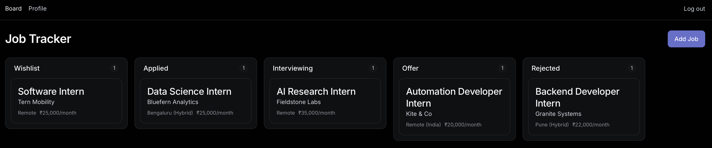
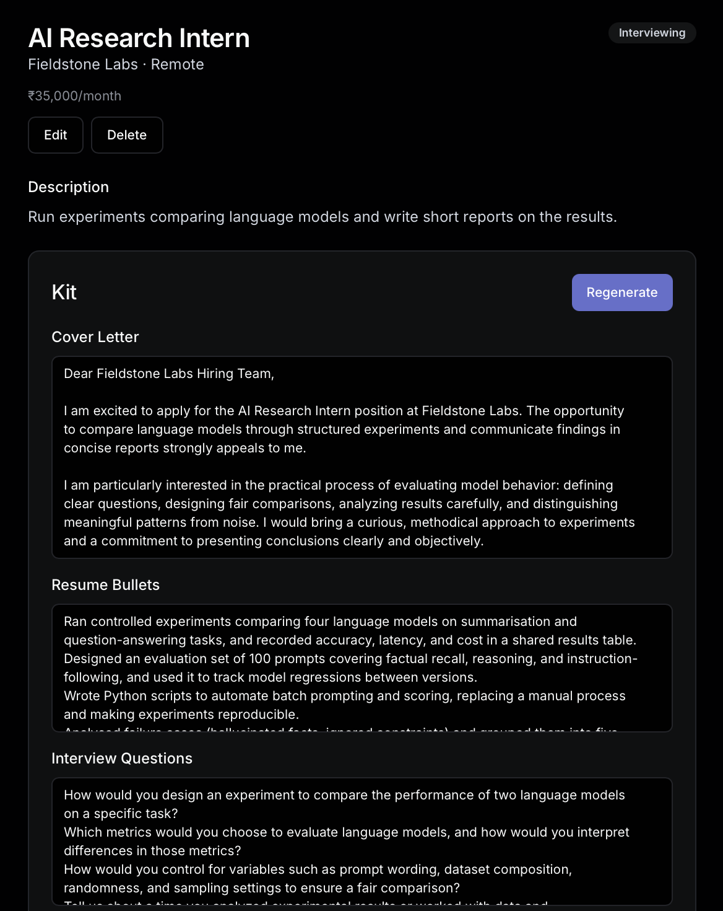

# Personal Job Application Tracker

A five-stage board for tracking job applications, with an AI layer that drafts a tailored cover letter, resume bullets, interview questions and a company brief for each role.



*Screenshots use seeded demo data — the companies are fictional.*

## Features

- **Five-stage kanban board** — Wishlist → Applied → Interviewing → Offer → Rejected; drag cards between and within stages (`@dnd-kit`), order persists.
- **Add a job by URL or pasted text** — the URL is fetched and reduced to readable text server-side (paste fallback if the site blocks it); an LLM extracts title, company, location, salary and description into an editable preview you confirm before the card is created.
- **Per-job AI "kit"** — cover letter, rewritten resume bullets, five likely interview questions, and a web-search-grounded company brief. Generated in parallel; one failure doesn't discard the other three. All fields are editable (debounced autosave) and can be regenerated.
- **Profile** — paste a resume or upload a PDF/DOCX (text extracted server-side), plus an optional "about me"; reused by every kit generation.
- **Accounts** — email + password registration and login, per-user data isolation, login lockout (5 failed attempts per email, 15 minutes).

## Tech stack

Next.js 15 (App Router) · React 19 · TypeScript (strict) · Tailwind 3 + shadcn/ui · SQLite via `better-sqlite3` (no ORM) · `@dnd-kit` · `zod` · `unpdf` / `mammoth` (resume parsing) · `jsdom` + `@mozilla/readability` + `html-to-text` (job-page extraction) · Vitest + Testing Library.



## How it works

**Architecture.** A single Next.js app: React pages in `app/`, REST-style route handlers in `app/api/`, data access in `lib/db.ts`. `middleware.ts` verifies a signed session cookie on every non-public request and forwards the user id to route handlers in an `X-User-Id` header; every query in `lib/db.ts` is filtered by that user id.

**AI layer.** All model calls go through one function, `callOpenRouter` (`lib/openrouter.ts`), a plain `fetch` to OpenRouter's chat-completions endpoint (no SDK) with a 120 s timeout. The provider is [OpenRouter](https://openrouter.ai); the model is `openai/gpt-5.6-luna` for both the text calls and the web-grounded call (constants in `lib/models.ts`; there is no model picker). Prompts are built in `lib/prompts.ts`.
- Job extraction uses `response_format: json_object`, validated with `zod`.
- *Generate Kit* (`POST /api/jobs/[id]/kit`) fires four calls in parallel with `Promise.allSettled`. Bullets and questions are JSON arrays validated with `zod` before saving; the company brief attaches OpenRouter's `web` plugin (`max_results: 5`).

**Database.** SQLite file `job-tracker.db` in the directory the server is started from. It is created automatically on the first request that touches the database (e.g. registering): `getDb()` opens the file in WAL mode with foreign keys on and runs `CREATE TABLE IF NOT EXISTS` for four tables — `users`, `profile`, `jobs`, `job_kits`. There are no migration files to run. The `*.db*` files are gitignored.

## Run locally

Requires Node 20 or newer (developed and tested on Node 22).

```bash
git clone https://github.com/krishnaagrawal17/JOB-TRACKER.git
cd JOB-TRACKER
npm install
cp .env.example .env.local   # then fill in the two values below
npm run dev                  # http://localhost:3000
```

Open `/register`, create an account, then add a job. Other scripts: `npm test` (Vitest), `npm run build`, `npm start`.

| Variable | Purpose | Where to get it |
|---|---|---|
| `OPENROUTER_API_KEY` | Authenticates all AI calls. Without it, extraction and kit generation fail. | Create a key at [openrouter.ai/keys](https://openrouter.ai/keys) |
| `AUTH_SESSION_SECRET` | Signs session cookies. If unset, every request returns 503 by design. | Generate locally: `node -e "console.log(require('crypto').randomBytes(32).toString('hex'))"` |

## Status

*Runs locally; not deployed.*

**Working**
- Board, drag-and-drop, add-job flow, job detail with editable kit, profile + resume upload, kit generation.
- Auth: registration, login/logout, scrypt-hashed passwords, signed HttpOnly session cookies, per-user data isolation, per-email lockout.
- 283 automated tests pass across 43 files (`npm test`, run 2026-10-01).
- A human has run the app in a browser and generated a kit end to end (recorded in `CLAUDE.md`, 2026-08-16).

**Partial**
- **Multi-user conversion** was built without a spec or plan and verified only by automated tests and curl — not yet by a human in a browser (login/register page styling and the links between them are unchecked).
- **Company brief citations**: the OpenRouter web plugin returns source links, but `callOpenRouter` discards them, so the brief shows no sources. The column and UI exist; the wiring is deferred.
- **Company briefs are only as good as the company's web presence.** Because the brief is web-grounded, a company with little or no online footprint can produce a confident brief about a *different*, similarly-named company. Observed in testing. Worth checking the brief against the company name before trusting it.
- **Auth review**: the auth work is merged into `main`, but the middleware gate's independent code review was never completed (reviewer API errors), so that diff has had no second pair of eyes.

## Built with AI assistance

This project was built with AI assistance (Claude Code) using a spec-first, test-driven workflow: a design spec and a 21-task implementation plan were written before any code (both in `docs/superpowers/`), each task was implemented test-first and reviewed, and the suite now stands at **283 tests across 43 files** (`npm test`).
